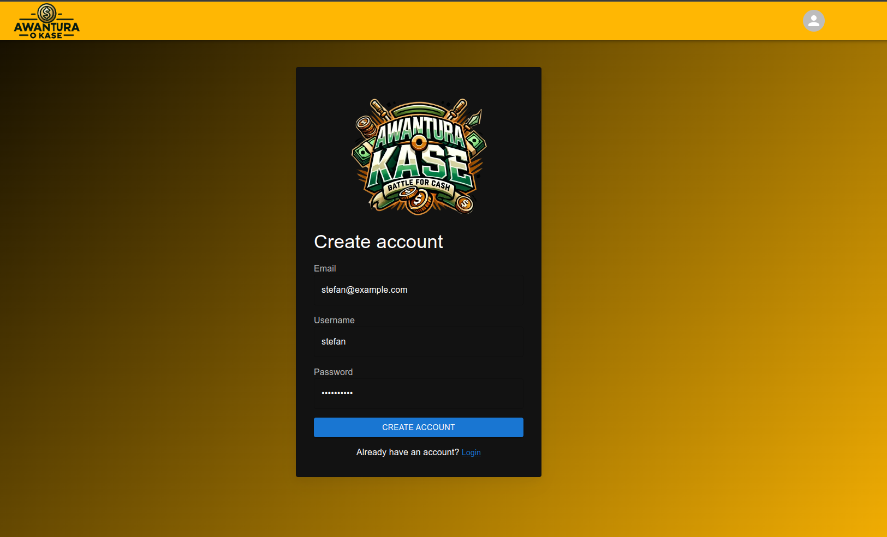

# Dokumentacja

## Spis treści

- [Opis projektu](#opis-projektu)
  - [Faza zgłaszania gotowości](#1-faza-zgłaszania-gotowości)
  - [Licytacja](#2-licytacja)
  - [Pytanie do zwycięzcy licytacji](#3-pytanie-do-zwycięzcy-licytacji)
  - [Koniec gry](#koniec-gry)
- [Frontend (Kod po stronie klienta)](#frontend-kod-po-stronie-klienta)
  - [Język programowania](#język-programowania)
  - [Architektura SPA i wybór technologii](#architektura-spa-i-wybór-technologii)
  - [Wykonywanie zapytań](#wykonywanie-zapytań)
  - [Autoryzacja i uwierzytelnianie użytkowników](#autoryzacja-i-uwierzytelnianie-użytkowników)
  - [Użyte biblioteki](#użyte-biblioteki)
    - [axios](#axios)
    - [Biblioteki komopnentów interfejsu użytkownika - MaterialUI](#biblioteki-komopnentów-interfejsu-użytkownika---materialui)
    - [Gsap](#gsap)
    - [react-custom-roulette](#react-custom-roulette)
    - [react-signalr](#react-signalr)
    - [styled-components](#styled-components)
- [Backend (kod po stornie serwera)](#backend-kod-po-stornie-serwera)

## Opis projektu

Stworzona aplikacja przeglądarkowa umożliwia rozegranie gry wzorowanej na teleturnieju [Awantura o kasę](https://pl.wikipedia.org/wiki/Awantura_o_kas%C4%99) pomiędzy 3 użytkownikami. Aby móc wziąć udział w rozgrywce użytkownik musi stworzyć konto i zalogować się.
W celu stowrzenia gry po zalogowaniu trzeba kliknąć w "Stwórz grę" na stronie głównej. By rozpocząć rozgrywkę należy wysłac link gry do 2 osób i poczekać, aż dołączą one do gry. W tym momencie automatycznie rozpocznie się pierwsza runda gry.
Gra składa się z 7 rund, a każda runda z 3 faz.

### 1. Faza zgłaszania gotowości


W tej fazie widoczna jest animacja kręcenia kołem losowania kategorii. Po końcu kręcenia odsłaniana jest wylosowana kategoria i użytkownicy mogą wyrazić swoją gotowość do licytacji. Gdy każdy wyrazi swoją gotowość automaycznie pojawia się ekran licytacji.

### 2. Licytacja


Podczas zmiany fazy na licytację z konta każdego z użytkowników zabierane jest 500 zł. Jeżeli gracz na początku rundy ma mniej niż 600zł automatycznie kończy grę. Jeżeli kwota mniejsza od 600zł jest większa niż 0 pozostałość jest dołączana do puli gry. Każdy z użytkowników na początku gry ma przydzielone 10.000 zł. Użytkownik ma opcję podbicia licytacji kwotą większą niż ostatnia kwota, która padła w tej rundzie i mniejszą równą sumie ostatniej licytowanej kwoty użytkownika (która znajduje się w puli gry) oraz pozostałego stanu konta. Licytowana kwota musi być podzielna przez 100.
Po każdym podbiciu licytacji ustawiany jest licznik czasu na 10 sekund. Jeżeli minie 10 sekund bez kolejnego podbicia, licytacja jest zakończona i gra przechodzi do pytania, na które odpowiada osoba, która włożyła do puli najwięcej pieniędzy.

### 3. Pytanie do zwycięzcy licytacji


W tej fazie na ekranie wyświetla się pytanie i 4 odpowiedzi, z których 1 jest poprawna. Wszyscy użytkownicy widzą to samo, z wyjątkiem efektu po najechaniu na odpowiedz, który pojawia się tylko u osoby, która wygrała licytację, co sugeruje, że jest ona uprawniona do odpowiedzi na pytanie. Po tym jak upraniona osoba kliknie na którąś z opcji gra przechodzi do kolejnej rundy i fazy 1. Jeżeli udzielona odpowiedź była poprawna pieniądze z puli gry przechodzą na konto użytkownika. W przeciwnym wypadku pieniądze zostają w puli do kolejnej rundy.

### Koniec gry


Po zakończeni 3 faz w 7 rundach użytkownikom wyświetla się ekran końcowy z odpowiednią wiadomoscią w zależności od tego, czy użytkownik wygrał, czy przegrał rozgrywkę. Wygrywa osoba, która po końcu ostatniej rundy będzie miała największą sumę na swoim koncie.

## Frontend (Kod po stronie klienta)

### Język programowania

Jako język programowania dla naszej aplijacji wybrany został TypeScript. Jego główną zaletą jest to, że jest on językiem typowanym, co oznacza, że programista musi określić typ danych dla każdej zmiennej. Dzięki temu wiele błędów jest wykrywalnych już na etapie pisania kodu, co przyspiesza proces debugowania i pomaga uniknąć błędów w trakcie działania aplikacji. W kontekście czystości kodu TypeScript wymusza stosowanie dobrych praktyk programistycznych, takich jak stosowanie interfejsów, czy korzystanie z typów generycznych.

### Architektura SPA i wybór technologii

Architektura SPA (Single Page Application) opiera się na jednorazowym ładowaniu całej aplikacji, która działa w ramach jednej strony. W odróżnieniu od tradycyjnego podejścia, w którym każda zmiana widoku powoduje przeładowanie całej strony, SPA pozwala na dynamiczną aktualizację tylko potrzebnych elementów, co przyspiesza reakcję aplikacji na interakcję użytkownika oraz zmniejsza obciążenie serwera.

Jednym z najczęściej wykorzystywanych technologii do budowy interfejsów użytkownika w SPA jest React. Biblioteka ta opiera się na idei tworzenia komponentów, które łączone są ze sobą w celu utworzenia kompletnych widoków. React wykorzystuje wirtualny DOM, co oznacza, że zmiany w stanie aplikacji są odzwierciedlane w DOMie tylko w tych miejscach, gdzie są potrzebne, dzięki czemu zmniejsza się liczba operacji na drzewie DOM i przyspiesza reakcja aplikacji.

### Wykonywanie zapytań

W cely wykonywania zapytań do aplikacji serwerowej używana jest biblioteka [`axios`](https://www.npmjs.com/package/axios). Za jej pomocą można w łatwy sposób wysyłać zapytania Http i obsługiwać błędy. Przykładowe użycie biblioteki -

```
export const AxiosClientPublic = axios.create({
    baseURL: API_URL
});

export async function createAccount(body: CreateAccountRequest) {
    await AxiosClientPublic.post('/Auth/Register', body);
}
```

### Autoryzacja i uwierzytelnianie użytkowników




Użytkownicy muszą zarejestrować się, by być w stanie uczestniczyć w rozgrywce. W tym celu muszą podać swój email, nazwę użytkownika i hasło. Email i nazwa użytkownika muszą być unikalne.

Po pomyślnym zalogowaniu się użytkownik otrzymuje dwa tokeny JWT. Jeden z nich jest ważny przez 15 minut, a drugi przez 7 dni. Pierwsze token jest zapisywany w pamięci aplikacji (jest tracony po odświeżeniu strony). Drugi, o dłuższym czasie ważności jest zapisywany jako ciasteczko HttpOnly. Oznacza to, że nie jest dostępny z poziomu kodu JavaScript i może być dołączone tylko do zapytań z konkretnego url strony.

To jest kod odpowiedzialny za obsługę zapytań z biblioteki `axios` do aplikacji serwerowej z odpowiednim tokenem JWT -

```

const useAxiosPrivate = () => {
const refresh = useRefreshToken();
const { auth } = useAuth();

useEffect(() => {
    const reqInterception = AxiosClient.interceptors.request.use(
      (config) => {
        if (config.headers && !config.headers['Authorization']) {
          config.headers['Authorization'] = `Bearer ${auth?.token}`;
        }
        return config;
      },
      (error) => Promise.reject(error)
    );

    const resInterception = AxiosClient.interceptors.response.use(
      (response) => response,
      async (error) => {
        const interceptedRequest = error?.config;
        if (error?.response?.status === 401 && !interceptedRequest?.sent) {
          interceptedRequest.sent = true;
          const newAccessToken = await refresh();
          interceptedRequest.headers['Authorization'] = `Bearer ${newAccessToken}`;
          return AxiosClient(interceptedRequest);
        }
        return Promise.reject(error);
      }
    );

    return () => {
      AxiosClient.interceptors.request.eject(reqInterception);
      AxiosClient.interceptors.response.eject(resInterception);
    };

}, [auth, refresh]);

return AxiosClient;
};

```

Kod ten dołącza do każdego requestu zapisany w pamięci aplikacji token JWT (Json Web Token). Gdy zapytanie nie powiedzie się, a kod statusu wynosi 401, aplikacja wykonje zapytanie po odświeżenie tokenu używając tokenu ważnego 7 dni i po otrzymaniu go ponownie wykonuje zapytanie, które się wcześniej nie powiodło. Token ważny 7 dni (refresh token) nie jest dołączany do innych zapytań, oprócz zapytania po odświeżenie tokenu.

Token zapisany w pamięci jest również używany do połączenia WebSocketowego za pomocą biblioteki `signalR` -

```

const { auth } = useAuth();
...
return (
    <SignalRContext.Provider
    connectEnabled={Boolean(auth.token)}
    accessTokenFactory={() => auth.token ?? ''}
    dependencies={[auth.token]}
    ...
    </SignalRContext.Provider>
);

```

### Użyte biblioteki

#### axios

[Opis](#wykonywanie-zapytań)

#### Biblioteki komopnentów interfejsu użytkownika - [MaterialUI](https://mui.com/)

`@emotion/react`, `@emotion/styled`, `@mui/icons-material`, `@mui/lab`, `@mui/material`, `@toolpad/core`

Biblioteki te umożliwiają szybkie i efektywne tworzenie estetycznych, responsywnych i spójnych wizualnie elementów interfejsu użytkownika. MaterialUI wykorzystuje wytyczne projektowe [Material Design](https://m3.material.io/) opracowane przez Google, co sprawia, że aplikacja ma nowoczesny i profesjonalny wygląd.

Biblioteki `@emotion/react`, oraz `@emotion/styled` nie są bezpośrednio wykorzysywane, lecz są wymagane dla prawidłowego funkcjonowanie bibliotek `@mui`.

Biblioteka `@mui/icons-material` zawiera dużą kolekcję ikon zgodnych stylowo z komponentami `@mui`. Przykład użycia -

```
import { ContentCopy } from '@mui/icons-material';
...
<Button endIcon={<ContentCopy />} onClick={onCopy}>
    Kopiuj link gry
</Button>
```

Biblioteka `@mui/lab` zawiera nowe komponenty, które nie są jeszcze w pełni gotowe by być zawartością biblioteki `@mui/material`. W naszym projekie została użyta do wykorzystania komponentu `LoadingButton` posiadającego stan ładowania przycisku, który jest przydatny do wykonywania akcji asynchronicznych po kliknięciu przycisku. Przykład użycia:

```
import LoadingButton from '@mui/lab/LoadingButton';
...
<LoadingButton
    variant="contained"
    color={PLAYER_COLOR_TO_BUTTON_COLOR_MAPPING[playerColor]}
    loading={isMakingBidLoading}
    onClick={onBidClick}>
    Licytuj ({amountToBid})
</LoadingButton>
```

Główna biblioteka, czyli `@mui/material` zawiera wiele komponentów, które zostały użyte w naszym projekcie, np.: `Button`, `Box`, `Paper`, `TextField`, `Link`, itp.
Biblioteka ta pozwala również na tworzenie swoich własnych motywów, które potem są odzwierciedlone w użytych komponentach. Przykład motywu naszej aplikacji:

```import { createTheme } from '@mui/material';
import type {} from '@mui/lab/themeAugmentation';

export const NAVBAR_BACKGROUND_COLOR = '#FFB703';

export const theme = createTheme({
  components: {
    MuiMenu: {
      styleOverrides: {
        list: {
          '&[role="menu"]': {
            backgroundColor: NAVBAR_BACKGROUND_COLOR
          }
        }
      }
    },
    MuiLoadingButton: {
      styleOverrides: {
        root: {
          '&[disabled]': {
            backgroundColor: 'rgba(255, 255, 255, 0.12)'
          }
        },
        loadingIndicator: {
          color: 'rgba(255, 255, 255, 0.3)'
        }
      }
    },
    MuiButton: {
      styleOverrides: {
        text: {
          color: '#E6E6FA'
        },
        outlinedPrimary: {
          borderColor: 'white',
          color: 'white',
          '&:hover': {
            borderColor: '#dcdcdc',
            color: '#dcdcdc'
          }
        }
      }
    }
  },
  palette: {
    background: {
      paper: '#121212'
    },
    text: {
      primary: '#FFF',
      secondary: 'rgba(255, 255, 255, 0.7)'
    }
  }
});
```

Biblioteka `@toolpad/core` została użyta do wyświetlania powiadomień użytkownikom. W komponentach, które są "dziećmi" komponenty `NotificationsProvider` można użyć hooka - `useNotification`, który zwraca funkcję, która służy do wyświetlania powiadomień. Hook z naszej aplikacji służący do wyświetlania powiadomień o błędzie:

```
import { useNotifications } from '@toolpad/core';
import { useCallback } from 'react';

export function useErrorNotification() {
  const notifications = useNotifications();

  return useCallback(
    (text: string) => notifications.show(text, { severity: 'error' }),
    [notifications]
  );
}
```

Przykładowe użycie hooka -

```
const notifyError = useErrorNotification();
...
const onBidClick = () => {
void (async () => {
    setIsMakingBidLoading(true);
    try {
        await axiosPrivate.post(`/Bids/MakeBid/${gameId}/${amountToBid}`);
    } catch (error) {
        console.error(error);
        notifyError(getErrorMessage(error));
    } finally {
        setIsMakingBidLoading(false);
    }
})();
};
```

#### Gsap

Biblioteka `gspa` służy do tworzenia animacji. Jest ona bardzo wydajna, elastyczna i bardzo popularna. Została użyta do animacji monety na stronie głównej. Kod użycia:

```
import { gsap } from 'gsap';
...
  useLayoutEffect(() => {
    const animation = gsap.context(() => {
      gsap
        .timeline({ repeat: -1 })
        .fromTo(
          DOLLAR_ICON_CLASS,
          {
            y: -20,
            visibility: 1
          },
          {
            duration: 2.5,
            ease: 'power1.inOut',
            y: 20
          }
        )
        .fromTo(
          DOLLAR_ICON_CLASS,
          {
            y: 20
          },
          {
            duration: 2.5,
            ease: 'power1.inOut',
            y: -20
          }
        );
    }, scope);

    return () => {
      animation.revert();
    };
  }, []);
```

#### react-custom-roulette

Biblioteka `react-custom-roulette` zapewnia komponent koła wykorzystanego w ekranie losowania kategorii rundy. Kod użycia:

```
import styled from 'styled-components';
import React, { useCallback, useEffect, useRef, useState } from 'react';
import { Wheel } from 'react-custom-roulette';
import { QUESTION_CATEGORIES, QUESTION_CATEGORY } from '../../types/game';
import { WheelData } from 'react-custom-roulette/dist/components/Wheel/types';
import { CATEGORIES_NAMES } from '../Navigation/constants';

const WheelContainer = styled.div`
  display: flex;
  justify-content: center;
  & > div {
    width: 345px;
    height: 345px;
  }
`;

const WHEEL_OPTIONS: WheelData[] = QUESTION_CATEGORIES.map((category) => ({
  option: CATEGORIES_NAMES[category]
}));

interface CategoryDrawScreen {
  onStopSpinning: () => void;
  category: QUESTION_CATEGORY;
}

export function CategoryDrawScreen({ onStopSpinning, category }: CategoryDrawScreen) {
  const [startSpinnig, setStartSpinning] = useState(false);
  const categoryIndex = WHEEL_OPTIONS.findIndex(
    ({ option }) => option == CATEGORIES_NAMES[category]
  );
  const isMounted = useRef(true);

  // Otherwise onStopSpinning callback will be called, even when component is already unomunted :/
  const onStop = useCallback(() => {
    if (isMounted.current) {
      onStopSpinning();
    }
  }, [onStopSpinning]);

useEffect(() => {
    isMounted.current = true;
    setStartSpinning(true);
    return () => {
      isMounted.current = false;
    };
  }, []);

  return (
    <WheelContainer>
      <Wheel
        data={WHEEL_OPTIONS}
        prizeNumber={categoryIndex}
        mustStartSpinning={startSpinnig}
        onStopSpinning={onStop}
      />
    </WheelContainer>
  );
}
```

#### react-signalr

`react-signalr` to biblioteka Microsoftu do obsługi komunikacji w czasie rzeczywistym w aplikacjach webowych. Umożliwia dwukierunkowe przesyłanie danych między serwerem a klientem za pomocą WebSocketów lub innych technologii (np. Server-Sent Events czy Long Polling, jeśli WebSockety nie są obsługiwane).

Komponent inicjalizujący SignalR -

```
import React, { PropsWithChildren } from 'react';
import { createSignalRContext } from 'react-signalr/signalr';
import { useAuth } from './AuthProvider';
import { useGameUpdates } from '../hooks/useGameUpdates';
import { InvokeEvents } from '../types/events';
import { useParams } from 'react-router-dom';

export const SignalRContext = createSignalRContext();

function SignalREventsListener({ children }: PropsWithChildren<object>) {
  useGameUpdates();

  return children;
}

export function GameSignalRContext({ children }: PropsWithChildren) {
  const { auth } = useAuth();
  const { id } = useParams();
  return (
    <SignalRContext.Provider
      connectEnabled={Boolean(auth.token)}
      accessTokenFactory={() => auth.token ?? ''}
      dependencies={[auth.token]}
      onOpen={() => void SignalRContext.invoke(InvokeEvents.JoinGameGroup, id)}
      url="/gamehub">
      <SignalREventsListener>{children}</SignalREventsListener>
    </SignalRContext.Provider>
  );
}
```

Przykład obsługi eventów przychodzących od aplikacji serwerowej -

```
export function useGameUpdates() {
  const { setGame, setIsWheelSpinningDone } = useGameContext();
  const { showNotification } = useGameNotifications();

  SignalRContext.useSignalREffect(
    GameUpdateEvent.PlayerJoined,
    (player: PlayerJoinedMessage) =>
      setGame((game) => ({
        ...game,
        players: {
          ...game.players,
          [player.playerColor]: {
            id: player.id,
            username: player.username
          }
        }
      })),
    [setGame]
  );

  SignalRContext.useSignalREffect(
    GameUpdateEvent.RoundStarted,
    (event: RoundStartedEvent) =>
      setGame((game) => ({
        ...game,
        currentRoundNumber: event.roundNumber,
        currentCategory: event.category,
        state: GAME_STATE.CATEGORY_DRAW
      })),
    [setGame]
  );
...
}
```

#### styled-components

`styled-components` to popularna biblioteka w ekosystemie React, umożliwiająca pisanie stylów CSS bezpośrednio w plikach JavaScript/TypeScript. Używa podejścia CSS-in-JS, co pozwala łączyć logikę komponentów z ich stylami w jednym miejscu. Przykład użycia:

```
import styled from 'styled-components';
const GameContentContainer = styled.div`
  width: 100%;
  height: 850px;
  display: flex;
  flex-direction: column;
  justify-content: center;
`;
```

## Backend (kod po stornie serwera)

[Dokumentacja backendu](./pdf/Dokumentacja%20Backend.pdf)
